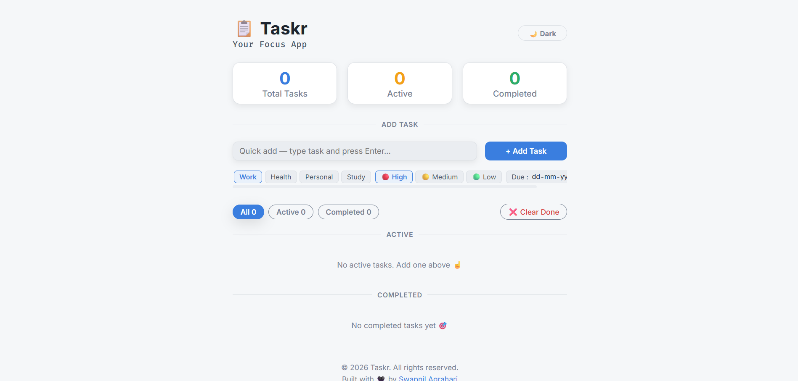
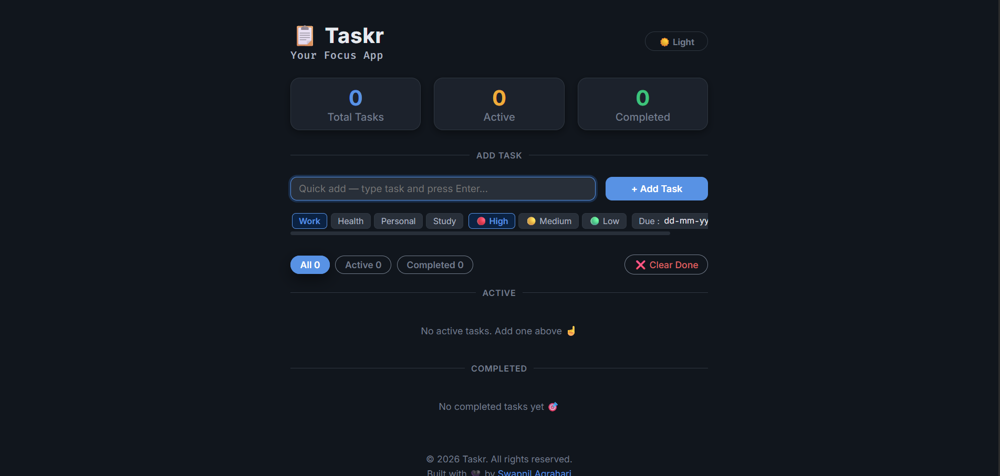

# Taskr — Your Focus App

A clean, fast, and lightweight task manager with categories, priorities, due dates, dark mode, and persistent storage.

---

## 🔗 Links

- **Live Site:** [https://ag-swapnil1.github.io/taskr](https://ag-swapnil1.github.io/taskr)
- **GitHub:** [ag-swapnil1/taskr](https://github.com/ag-swapnil1/taskr)

---

## 📸 Screenshots

**Light Mode:**


**Dark Mode:**


---

## ✨ Features

- Add tasks with category, priority and due date
- Mark tasks as complete / restore to active
- Filter by All, Active, or Completed
- Clear all completed tasks in one click
- Live stats — Total, Active, Completed counts
- Dark / Light theme toggle
- Tasks persist across sessions via localStorage
- Fully responsive — mobile and desktop

---

## 🛠️ Built With

- Semantic HTML5
- CSS custom properties (design tokens)
- CSS Grid & Flexbox
- Vanilla JavaScript — no libraries or frameworks
- localStorage for persistence
- Google Fonts — Inter, Fira Code

---

## 📁 Project Structure

```
calculite/
├── css/
│   └── index.css
├── js/
│   └── index.js
├── docs/
|   ├── light-preview.png
│   ├── mobile-preview.png
│   └── dark-preview.png
├── .gitignore
├── LICENSE
├── README.md
└── index.html
```

---

## 🚀 Getting Started

```bash
git clone https://github.com/ag-swapnil1/taskr.git
cd taskr
open index.html
```

No build tools or dependencies — pure HTML, CSS & JavaScript.

---

## 👤 Author

- **GitHub:** [@ag-swapnil1](https://github.com/ag-swapnil1)
- **Frontend Mentor:** [@ag-swapnil1](https://www.frontendmentor.io/profile/ag-swapnil1)

---

## 📄 License

Open source under the [MIT License](./LICENSE).